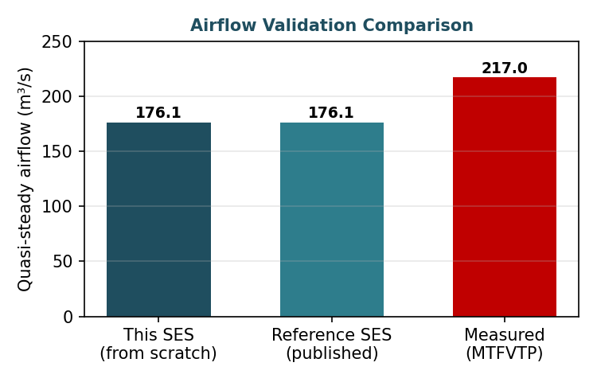
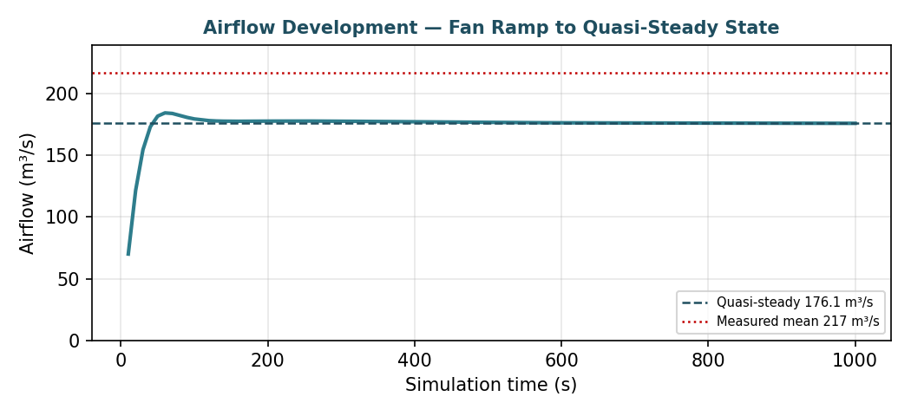
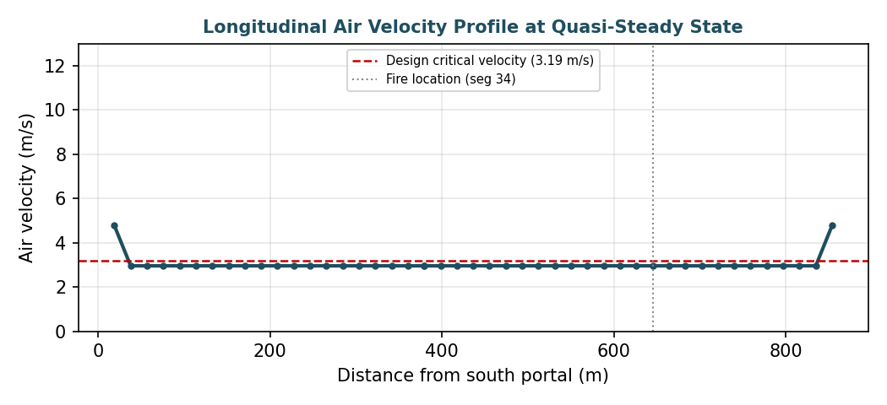
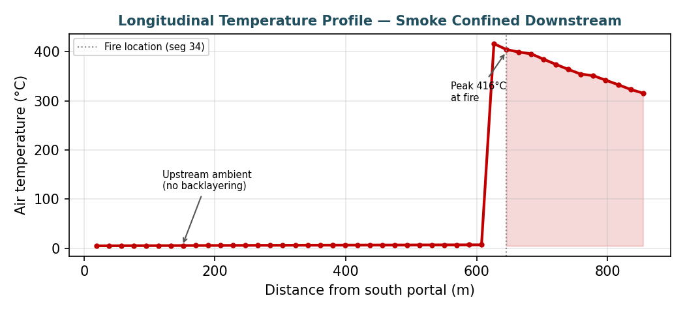

# Memorial Tunnel TVS — SES v4.1 Validation & Emergency Ventilation Design

A complete, from-scratch **SES v4.1** model of the Memorial Tunnel longitudinal emergency ventilation system, validated against the full-scale **Memorial Tunnel Fire Ventilation Test Program (MTFVTP)**.

> **Headline result:** the independently-constructed model reproduces the published reference SES result to **0.0% deviation** on quasi-steady airflow (176.1 m³/s), and under-predicts the measured airflow (217 m³/s) by 18.8% — the expected conservative bias for 1-D longitudinal fire modelling.

---

## Why the Memorial Tunnel

The Memorial Tunnel is the most comprehensively instrumented full-scale tunnel fire ventilation dataset in existence — a 853 m road tunnel where, from 1993–1995, 98 full-scale fire tests generated over three million measured data points. Because the geometry, fire sizes, fan configurations, and measured results are all public, an SES model can be built from scratch **and validated against real data** — exactly what a paid validation commission looks like.

## Project scope

Two integrated objectives, executed as a full deliverable set:

1. **Validation** — reproduce the measured behaviour of the Memorial Tunnel fire tests in SES v4.1 and quantify the model error.
2. **Emergency ventilation design** — use the validated model to establish the jet-fan operating strategy that maintains critical velocity and tenability across the design fires.

## Model summary

| Parameter | Value |
|---|---|
| Tunnel length | 853.75 m (46 line segments, 45 sections, 46 nodes) |
| Grade | 3.2% |
| Cross-section | ~60 m² (portals narrower) |
| Ventilation | Longitudinal, reversible jet fans (impulse-fan momentum sources) |
| Design fire | 100 MW (Test 615B), fire on segment 34 |
| Friction factor | 0.0055 (fully turbulent) |
| Simulation | 1000 s transient, 5 s time step |

## Key result

| Quantity | Value | Deviation |
|---|---|---|
| This SES model (from scratch) | **176.1 m³/s** | — |
| Reference SES (published) | 176.1 m³/s | **0.0%** |
| Measured (MTFVTP mean) | 217.0 m³/s | −18.8% |

The temperature field confirms correct physics: ambient upstream (~5 °C, no backlayering), a sharp peak at the fire (416 °C), and smooth downstream decay — the signature of effective longitudinal smoke control.

## Results



**Figure 1.** Airflow validation — the from-scratch SES model matches the published reference exactly (176.1 m³/s), and under-predicts the measured mean by 18.8% (conservative).



**Figure 2.** Airflow development over the simulation — flow rises from rest as the jet fans spin up, reaching the quasi-steady 176.1 m³/s.



**Figure 3.** Longitudinal air velocity profile at quasi-steady state, with the design critical velocity (3.19 m/s) and fire location marked.



**Figure 4.** Longitudinal temperature profile — the upstream-cool / downstream-hot pattern is the signature of effective longitudinal smoke control.

---

## Deliverable set

A full consulting deliverable chain, mirroring a real paid commission:

| Ref | Deliverable |
|---|---|
| D1 | Design Basis Report |
| D2 | Critical Velocity & Fan Sizing (live Excel workbook with worked methodology) |
| D3 | SES Model Build Documentation (card-by-card) |
| D5 | Long-Term Heat Sink Analysis (restart-file workflow) |
| D6 | SES Validation Report *(this result)* |
| D7 | Validation & Post-Processing Toolkit (Python PRN parser + Excel/VBA workbook) |
| D8 | Fan Operating Matrix (emergency response) |
| D9 | Final Engineering Report |

## Repository contents

```
01-memorial-tunnel-ses/
├── README.md                          (this file)
├── deliverables/                      the D1–D9 documents
├── ses-input/
│   └── memorial_tunnel_100MW.inp      the validated SES v4.1 deck
├── post-processing/
│   ├── parse_prn.py                   SES .PRN → tidy CSV (SI), tested on real output
│   └── validation_workbook.xlsx       SES-vs-measured comparison + dashboard
└── results/
    └── validation_summary.md          the numbers above, with method notes
```

## The post-processing pipeline

`parse_prn.py` reads the SES fixed-format `.PRN` output — correctly handling the multi-page partitioning tables that break naive parsers — and extracts per-section airflow, velocity, and temperature across all time steps, converting to SI. The validation workbook consumes the parsed CSV and computes the SES-vs-measured error automatically.

```bash
python parse_prn.py memorial_tunnel_100MW.PRN
# → memorial_tunnel_100MW_parsed.csv  (45 sections × 91 time steps)
```

## Engineering notes

A few hard-won lessons documented across the build:

- **Critical velocity** by the Froude/Kennedy method with grade correction; the 100 MW analytical value (3.19 m/s) lands at the top of the measured backlayering-control band (~2.5–3.0 m/s), independently confirming the method.
- **Impulse fans** attach to line segments by *segment type*, not by naming individual segments — the jet fans and portal wind are two fan types deployed on typed segments.
- **Minor (K) losses** are concentrated on a single interior segment and are essential: omitting them roughly halves the tunnel resistance and doubles the predicted airflow.
- **SES fixed-format** is unforgiving — integer fields must be integers (no trailing decimals), files need CRLF line endings, and every form must be present and complete.

---

*Tools: SES v4.1 · Next-In / Next-Out · Python · openpyxl · NFPA 502/130.*
