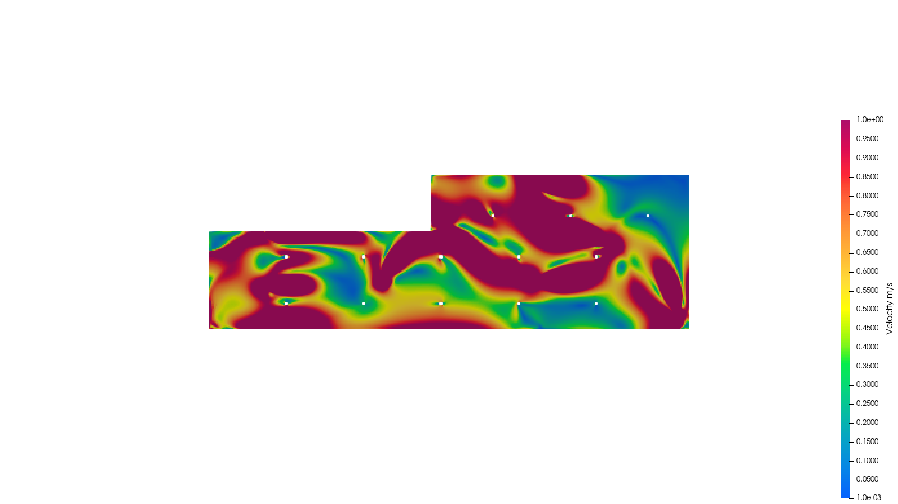
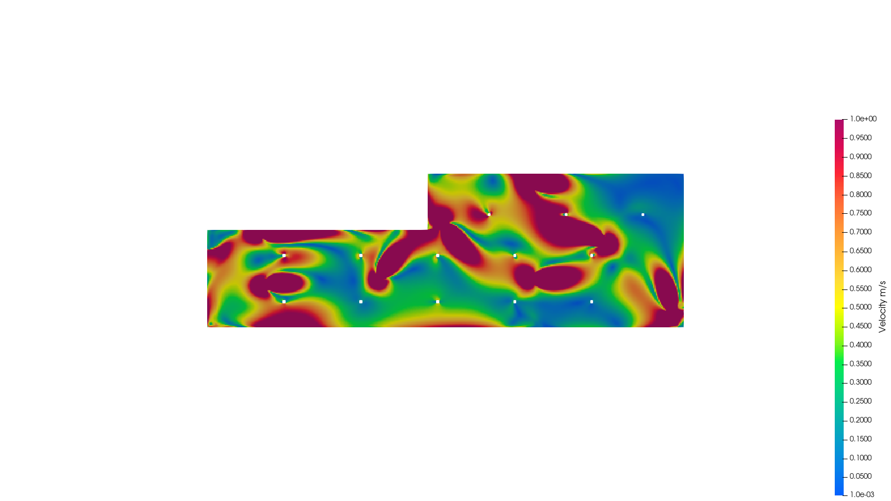
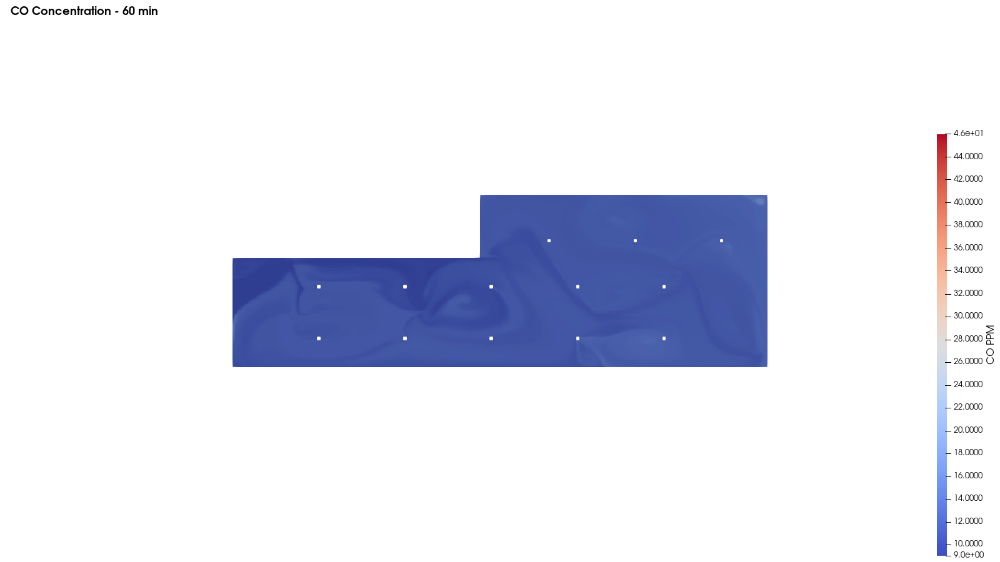
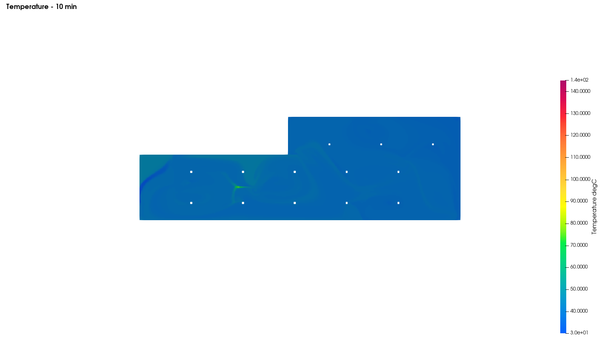
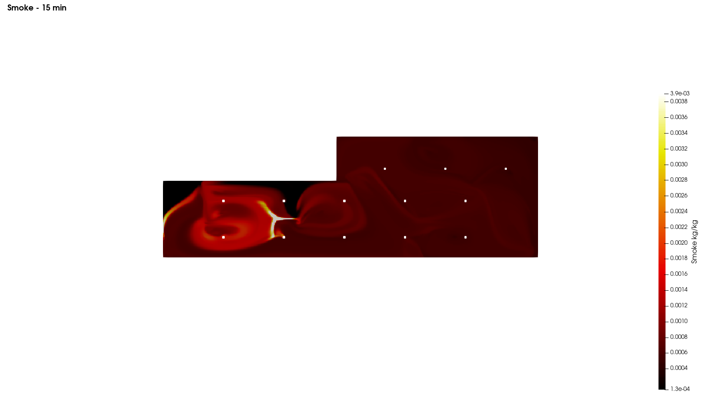
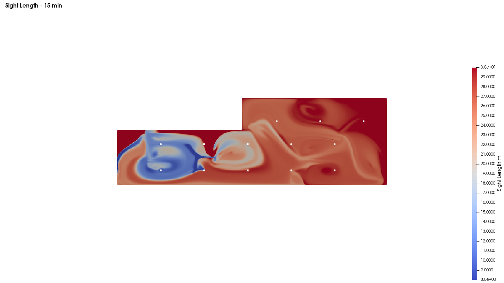

# DoubleTree by Hilton — Car Park Ventilation CFD

Full **three-case OpenFOAM 12** simulation of the DoubleTree by Hilton hotel car park (Guwahati), replicating a PHOENICS-based parking-ventilation study across steady airflow, CO transport, and a fire/smoke transient.

> **Domain:** 93 × 30 × 3.4 m  ·  **Mesh:** ~632,000 cells  ·  **Fans:** 8 × ACJF-315 jet fans  ·  **Design fire:** 4 MW car fire

---

## Three-case methodology

| Case | Scenario | Solver | Key output |
|---|---|---|---|
| A | Steady jet-fan airflow | `simpleFoam` (parallel, 16 cores) | Velocity field at occupant and fan heights |
| B | CO transport — 60 min | Frozen-flow two-stage scalar transport | CO ppm at breathing level vs ASHRAE |
| C | Fire & smoke transient | `foamRun -solver fluid` (buoyant) | Temperature, smoke, sight length |

---

## Case A — Steady Airflow

The 8 ACJF-315 jet fans drive a complex, recirculating flow field through the L-shaped car park. Two horizontal slices are shown at occupant height (1.7 m) and fan discharge height (2.5 m).



**Figure 1.** Velocity magnitude at 1.7 m (occupant/breathing level). The jet fans produce high-velocity discharge zones (~1 m/s) that drive recirculating flow throughout both sections of the car park, ensuring air exchange across the full domain.



**Figure 2.** Velocity magnitude at 2.5 m (fan discharge height). The fan plumes are more energetic and clearly visible; momentum dissipates as the jets entrain surrounding air and drive the lower-level circulation.

---

## Case B — CO Transport (60 minutes)

CO transport is solved using the **frozen-flow two-stage method**: the converged Case A velocity field is used as a fixed advecting field for the scalar-transport stage. This correctly accounts for jet-fan-driven dilution.



**Figure 3.** CO concentration (ppm) at t = 60 min (3600 s), horizontal slice at breathing level. The space is predominantly in the 9–15 ppm range (blue), well below the ASHRAE 35 ppm 1-hour limit. A localised zone near the entry reaches the upper range (~46 ppm) reflecting the CO source boundary, but the jet-fan ventilation maintains compliance across the occupied areas.

| Metric | Value | ASHRAE limit | Status |
|---|---|---|---|
| Peak CO (breathing level, occupied zone) | ~15 ppm | 35 ppm (1-hr) | ✅ Compliant |
| ASHRAE maximum (short exposure) | — | 120 ppm | ✅ Well below |

---

## Case C — Fire & Smoke Transient

A 4 MW car fire is modelled as a buoyant transient using `foamRun -solver fluid`. Temperature, smoke concentration, and sight length are reported at representative times.



**Figure 4.** Temperature (°C) at t = 10 min (600 s). The bulk of the space remains at ambient (~30°C); the fire produces a localised thermal plume (green/yellow, ~100°C) confined to the immediate fire zone. The jet fans limit thermal spread across the car park.



**Figure 5.** Smoke concentration (kg/kg) at t = 15 min (900 s). The smoke layer is densest near the fire origin (left section, white/yellow core) and dissipates significantly across the right section. The jet fans entrain and dilute the smoke plume.



**Figure 6.** Sight length (m) at t = 15 min (900 s). Blue zones (8–15 m visibility) are confined to the immediate fire region; the majority of the car park maintains sight lengths above 20 m (orange/red), indicating adequate evacuation visibility across most of the domain.

---

## Key methodology notes

**Two-stage scalar transport** — the standard method established across all Synoptic CFD car park projects: run `foamRun -solver incompressibleFluid` with `fvModels` active to produce the jet-fan-driven flow field (Stage 1); then run scalar transport reading the frozen field (Stage 2). `fvModels` are silently ignored under `foamRun -solver functions` — Stage 1 must use the direct solver.

**Fire scenario** — `foamRun -solver fluid` (buoyant incompressible) with temperature and smoke as empirically calibrated sources. Jet fans remain active as momentum sources during the fire transient.

**Parallel execution** — Case A ran on 16 cores (`mpirun -np 16 --oversubscribe`) with domain decomposition via `decomposePar`; results reconstructed with `reconstructPar` before post-processing.

---

## Repository contents

```
03-doubletree-carpark-cfd/
├── README.md
├── methodology/
│   └── three_case_method.md     case A→B→C workflow and solver choices
├── scripts/
│   └── run_all.sh               parallel run sequence
└── results/
    └── figures/
        ├── A_Adult_Height_1_7m-1ms_07.png   Case A: velocity at 1.7m
        ├── A_Fan_Height_2_5m-1ms_07.png     Case A: velocity at 2.5m
        ├── B_CO_3600.png                    Case B: CO at 60 min
        ├── C_T_600.png                      Case C: temperature at 10 min
        ├── C_smoke_900.png                  Case C: smoke at 15 min
        └── C_sl_900.png                     Case C: sight length at 15 min
```

---

*Tools: OpenFOAM 12 · simpleFoam · scalarTransport · foamRun fluid · ParaView · PHOENICS (benchmark).*
