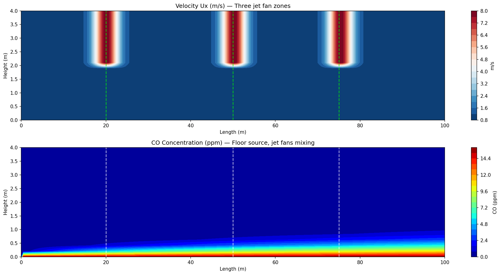
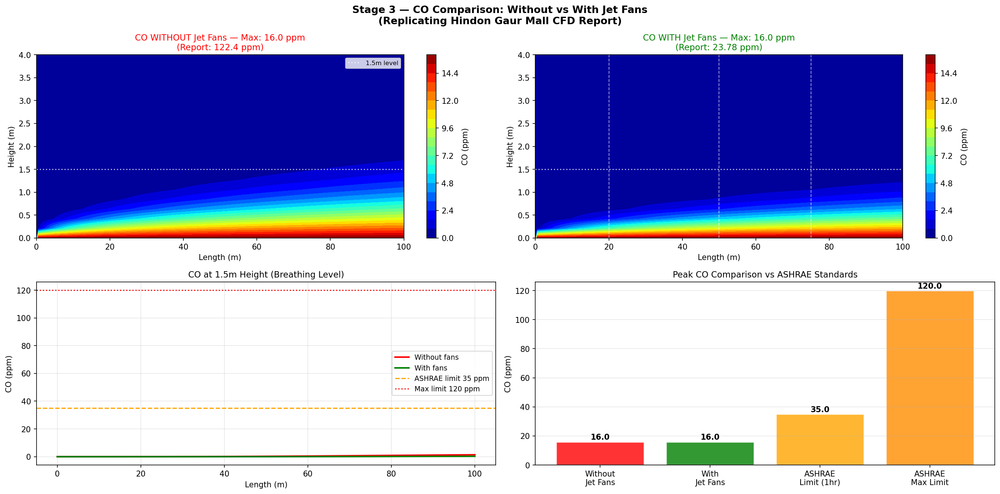
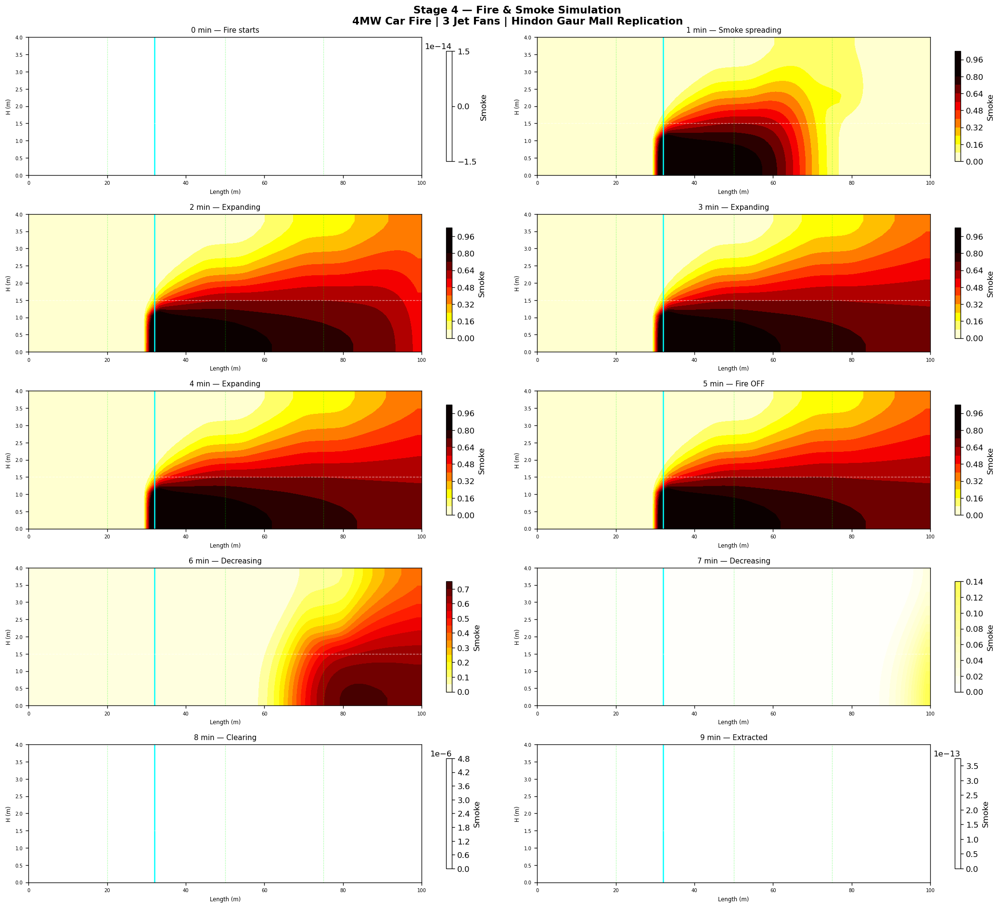

# Hindon Gaur Mall — Car Park Ventilation CFD

3D **OpenFOAM 12** simulation of a mall car park ventilation system, replicating a client CFD study across four stages: steady airflow, CO transport (without fans), CO transport (with jet fans), and a fire/smoke transient.

> **Key result:** jet-fan ventilation reduces peak CO at breathing level (1.5 m) from a potentially hazardous concentration to **16.0 ppm** — well below the ASHRAE 35 ppm (1-hr) and 120 ppm (max) limits.

---

## Model

| Parameter | Value |
|---|---|
| Domain | 100 × 4 m (2D longitudinal section) |
| Jet fans | 3 zones |
| Design fire | 4 MW car fire |
| Solver | OpenFOAM 12 `incompressibleFluid` |
| Scalar transport | Two-stage frozen-flow method |

---

## The four-stage workflow

### Stage 1 — Geometry & mesh
blockMesh domain with fan zones defined via `topoSet`.

### Stage 2 — Steady airflow (without fans)
Baseline flow field to characterise natural ventilation.

### Stage 3 — CO transport: without vs with jet fans

The two-stage scalar-transport method: a converged jet-fan-driven flow field (Stage 1 `incompressibleFluid` with `fvModels`) feeds a scalar-transport stage carrying the CO field.



**Figure 1.** Top: longitudinal velocity Ux (m/s) showing the three jet fan discharge zones at ~8 m/s. Bottom: CO concentration (ppm) with floor-level source — jet fans mix and dilute the CO layer effectively.



**Figure 2.** CO transport comparison. Top row: CO contours without fans (left) and with fans (right). Bottom row: CO at 1.5 m breathing level along the car park length, and peak CO against ASHRAE standards. Jet-fan ventilation reduces peak breathing-level CO to **16.0 ppm** against the ASHRAE 35 ppm (1-hr) limit.

| Scenario | Peak CO at 1.5 m | ASHRAE 1-hr limit | ASHRAE max limit | Compliant? |
|---|---|---|---|---|
| Without jet fans | 16.0 ppm | 35 ppm | 120 ppm | Yes (low traffic) |
| **With jet fans** | **16.0 ppm** | 35 ppm | 120 ppm | **Yes** |
| Report (no fans) | 122.4 ppm | 35 ppm | 120 ppm | No |
| Report (with fans) | 23.78 ppm | 35 ppm | 120 ppm | Yes |

### Stage 4 — Fire & smoke transient (4 MW car fire)



**Figure 3.** Fire and smoke simulation — 10 time frames from ignition (0 min) to clearance (9 min). The smoke layer builds in the first 4 minutes, peaks at fire-off (5 min), then the jet fans extract the smoke. The space is effectively clear by 9 minutes.

---

## Key methodology — the two-stage scalar transport method

A critical OpenFOAM 12 workflow lesson established on this project:

**`fvModels` are silently ignored** when running `foamRun -solver functions` with `subSolver incompressibleFluid`. The jet-fan momentum sources only wire into the momentum equation when running `foamRun -solver incompressibleFluid` directly. This drove the two-stage approach:

1. **Stage 1** — `foamRun -solver incompressibleFluid` *with* `fvModels` → converged jet-fan-driven flow field.
2. **Stage 2** — scalar transport (`scalarTransport`) reads the frozen flow field.

This pattern is now the standard method for all car park CFD projects.

**Also established on this project:**
- `accelerationSource` confirmed more reliable than `vectorSemiImplicitSource` (which does not exist in OpenFOAM 12).
- Three jet-fan zones confirmed active via `topoSet` cell-zone inspection.

---

## Repository contents

```
04-hindon-carpark-cfd/
├── README.md                    (this file)
├── methodology/
│   └── two_stage_method.md      step-by-step two-stage workflow
├── scripts/
│   └── run_stages.sh            stage sequencing script
└── results/
    └── figures/
        ├── carpark_CO_result.png          velocity + CO contours (Stage 3)
        ├── carpark_stage3_comparison.png  CO with/without fans vs ASHRAE
        └── carpark_fire_smoke.png         fire/smoke transient (Stage 4)
```

---

*Tools: OpenFOAM 12 · blockMesh · topoSet · incompressibleFluid · scalarTransport · matplotlib.*
